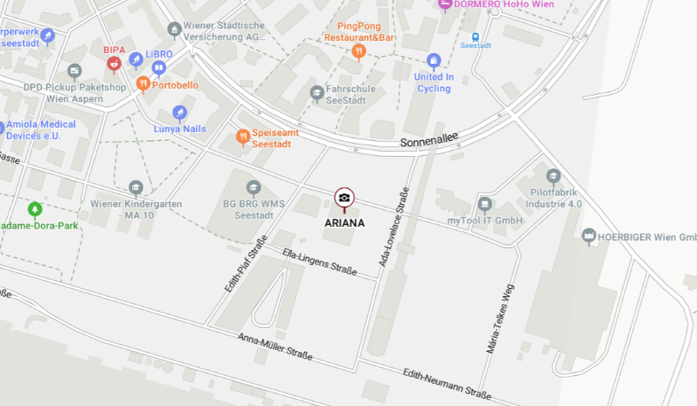

```html
<!DOCTYPE html>
<html lang="de">
<head>
    <meta charset="UTF-8">
    <meta name="viewport" content="width=device-width, initial-scale=1">
    <title>Einladung</title>

    <!-- Google Fonts (nur als Code sichtbar) -->
    <link rel="preconnect" href="https://fonts.googleapis.com">
    <link rel="preconnect" href="https://fonts.gstatic.com" crossorigin>
    <link href="https://fonts.googleapis.com/css2?family=Gulzar&family=Meie+Script&family=Playfair+Display:wght@700&family=Great+Vibes:wght@400;700&display=swap" rel="stylesheet">

    <style>
        .kleinschrift {
            font-size: 30px;
            font-weight: 400;
            color: #666;
            margin-left: -5px;
        }

        .grosschrift {
            font-size: 30px;
        }

        body {
            margin: 0;
            font-family: 'Great Vibes', cursive;
            background: #f8f8f8;
            font-size: 64px;
            letter-spacing: 4px;
            color: #333;
            line-height: 2;
        }

        p, h1, h2, h3, h4, h5, h6 {
            margin-bottom: 13px;
        }

        section {
            padding: 40px 20px;
            max-width: 900px;
            margin: auto;
            opacity: 0;
            transform: translateY(30px);
            animation: fadeIn 1.5s forwards;
        }

        h1 { font-size: 56px; }
        h2 { font-size: 48px; }
        h3 { font-size: 22px; }
        h4 { font-size: 28px; }
        h5 { font-size: 44px; font-family: 'Meie Script'; }
        p  { font-size: 24px; }

        .persian-line {
            font-family: 'Gulzar', serif;
            direction: rtl;
            unicode-bidi: isolate;
            font-size: 22px;
        }

        .hero {
            height: 70vh;
            background: url('her.png') center/cover no-repeat;
            display: flex;
            justify-content: center;
            align-items: center;
            color: #fff;
        }

        .monogram .initials {
            font-family: 'Playfair Display', serif;
            font-size: 80px;
        }

        .map {
            width: 100%;
            border-radius: 8px;
        }

        @keyframes fadeIn {
            to { opacity: 1; transform: translateY(0); }
        }
    </style>

    <script>
        document.addEventListener('DOMContentLoaded', function () {
            const elements = document.querySelectorAll('.animate-on-scroll');
            const observer = new IntersectionObserver(entries => {
                entries.forEach(entry => {
                    if (entry.isIntersecting) {
                        entry.target.classList.add('visible');
                    }
                });
            });
            elements.forEach(el => observer.observe(el));
        });
    </script>
</head>

<body>

<section class="hero">
    <div class="monogram">
        <div class="initials">A ♥ M</div>
        <div>Save the Date</div>
        <div>20/03/2026</div>
    </div>
</section>

<section>
    <h5>Ahmad & Mina</h5>
    <p class="grosschrift">Liebe Familie und Freunde,</p>
    <p>
        Wir freuen uns sehr, euch am <strong>20. März 2026 um 16:00</strong>
        Uhr zu unserer Hochzeit einzuladen.
    </p>

    <p class="persian-line">به همراه خانواده‌های عزیزمان،</p>
    <p class="persian-line">شما را با کمال افتخار دعوت می‌کنیم</p>
</section>

<section>
    <h2>Location / Ariana Event</h2>
    
    <p>Christine-Touaillon-Straße 4, 1220 Wien</p>
</section>

</body>
</html>
```
